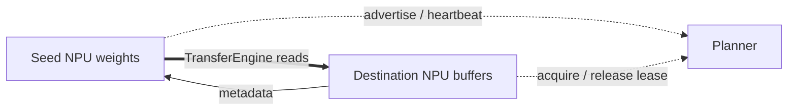

# Tensor R-Fork (RFork) Guide

Tensor R-Fork is a warm-start model loader for vLLM Ascend. A new instance can
request a compatible running **seed** from a planner and copy its registered NPU
weights through YuanRong TransferEngine instead of reading the checkpoint again.
The first instance still loads from storage normally.

## Architecture and loading flow

RFork has four components:

- the **planner**, which tracks seeds, health, capacity, and transfer leases;
- the **seed instance**, which registers and advertises live NPU weights;
- the **destination instance**, which prepares matching local buffers;
- **YuanRong TransferEngine**, which transfers bytes between the two instances.

Each TP/PP/EP worker owns an independent RFork session and exchanges only its
local shard. The seed HTTP service carries metadata; tensor data travels through
TransferEngine.



The destination performs these steps:

1. Build a compatibility key and initialize the model on NPU.
2. Prepare the required tensor layout and register destination memory.
3. Acquire one seed lease, fetch its manifest, validate every tensor, and read
   the weights in bounded batches.
4. Release the source lease asynchronously, finish post-load processing, and
   switch the model to evaluation mode.
5. Register and advertise the loaded model as another seed when cleanup and
   lease state allow it.

If no compatible seed is available, or transfer fails, RFork unregisters the
prepared memory and uses the default loader. It refuses to allocate a second
model if cleanup cannot prove that the old registered memory is safe to release.
A failed seed-service startup does not discard a successfully loaded model.

## Lifecycle guarantees

`RForkSession` owns the planner lease, TransferEngine, registered tensor owners,
seed HTTP service, heartbeat, and shutdown state. Memory remains pinned while a
seed may still be read. Cleanup stops heartbeats, removes the advertisement,
stops the HTTP server, unregisters memory, and only then finalizes
TransferEngine.

Lease release uses bounded background retries. Network errors, HTTP 408/429,
and 5xx responses are retryable; other rejected responses stop immediately.
HTTP 200 and 404 are treated as acknowledged releases. An unresolved lease
delays seed publication without blocking inference, but shutdown retains the
TransferEngine resources rather than freeing memory prematurely.

Fallback restores vLLM compilation registries, compiler hooks, MoE registries,
and rotary caches to their pre-attempt state before the default loader
constructs another model. Model construction and rollback are assumed to be
serialized within each worker.

## Configuration

Enable RFork with `--load-format rfork` and pass a JSON object through
`--model-loader-extra-config`.

| Field | Default | Description |
|---|---:|---|
| `model_url` | unset | Stable model identity; required. |
| `model_deploy_strategy_name` | unset | Deployment identity; required. |
| `rfork_scheduler_url` | unset | Planner base URL; required. |
| `rfork_seed_timeout_sec` | `5.0` | Positive seed-server startup timeout. |
| `rfork_request_timeout_sec` | `10.0` | Positive HTTP connect/read timeout. |
| `rfork_heartbeat_interval_sec` | `30.0` | Positive JSON-only heartbeat interval. |
| `rfork_lease_release_max_attempts` | `3` | Positive JSON-only fast-attempt count before slower background retries for transient failures. Permanent rejection still stops retries. |
| `rfork_lease_release_retry_interval_sec` | `30.0` | Positive JSON-only retry interval. |
| `rfork_seed_bind_host` | `0.0.0.0` | Local seed HTTP bind address. |
| `rfork_seed_advertise_host` | auto | Address reported to the planner. |

The following environment variables are fallbacks for the corresponding JSON
fields:

| Environment variable | Default |
|---|---:|
| `MODEL_URL` | unset |
| `MODEL_DEPLOY_STRATEGY_NAME` | unset |
| `RFORK_SCHEDULER_URL` | unset |
| `RFORK_SEED_TIMEOUT_SEC` | `5.0` |
| `RFORK_REQUEST_TIMEOUT_SEC` | `10.0` |
| `RFORK_SEED_BIND_HOST` | `0.0.0.0` |
| `RFORK_SEED_ADVERTISE_HOST` | auto |

Explicit valid JSON values take precedence over environment variables.

## Compatibility key and manifest

The planner key includes the complete normalized Hugging Face configuration,
model revision, deployment strategy, parallel topology, device type, and Ascend
weight-layout policy. The effective KV producer/consumer role always isolates
P/D seeds because SFA/MLA post-load processing can materialize different
weights. Other known construction or weight-layout switches remain isolated:
MLAPO and sparse-SFA layouts; DSA-CP; fine-grained module TP sizes and their DP
layout rank; MoE shared-expert layout; model-runner generation; model length,
batched-token and cache sizing; speculative method and draft layout; effective
per-layer quantization; and selected Multimodal tower/pruning/parallel and
LoRA/prompt-adapter/pooler layout fields. These can change RFork-transferable
tensor names, shapes, dtypes, formats, or derived contents even with the same
checkpoint. The descriptor is hashed, so the logged fingerprint is always 64
hexadecimal characters regardless of field count.

Runtime-only settings such as logging paths, planner addresses, lease timeouts,
request scheduling policies, KV-connector network endpoints, ACLGraph capture
sizes, request-count capacity, and KV-cache layout options are excluded because
they do not materialize tensors collected from the model for RFork weight
transfer. The DSA metadata-builder buffers sized by graph capture are outside
that model-tensor collection. Revision matching prefers the
resolved checkpoint commit hash. Use immutable model identities for local
checkpoints because RFork does not hash checkpoint contents. RFork still
validates the final manifest and falls back instead of copying incompatible
tensors; update this descriptor whenever a new post-load layout switch is added.
This config audit covers the currently known model and attention construction
paths; it is not a promise that future model adapters cannot add new switches.
Dynamic EPLB and static expert maps bypass RFork before fingerprinting because
their placement cannot be transferred safely.

RFork intentionally supports only its current metadata protocol; mixed RFork
versions are rejected through a mandatory protocol-version field. Every
manifest entry contains exactly five fields:

```text
[device_pointer, element_count, element_size, shape, dtype]
```

The same response also carries a mandatory NPU storage format for every tensor,
target-shared draft tensor names, and selected non-tensor load state. The
receiver validates names, shape, dtype, format, element count, element size,
device, and dense storage coverage before any native read, then restores
load-derived booleans that a byte transfer cannot reproduce. Restart the
planner and all RFork instances after changing RFork code so no stale seeds
remain advertised.

## Tensor layouts

Quantized models transfer their prepared inference tensors. Checkpoint-layout
models transfer checkpoint tensors and run the remaining post-load hooks after
the read. RFork collects parameters, buffers, and supported runtime tensors;
empty, meta, CPU, gapped, or overlapping tensors are rejected.

Dense transposes are supported because their logical elements still cover one
continuous byte range. A receiver tensor may be reshaped with a storage-preserving
view when its element count matches the manifest. Shape equality alone does not
prove arbitrary stride or physical-layout compatibility; the diagnostic summary
below records those differences without changing transfer acceptance.

A draft model may reuse tensors already owned and registered by its target. If
all transferable tensors are shared, RFork skips draft transfer and post-load
rewrites. Partial overlap continues through the normal transfer path. Draft seed
publication is deferred until spec-decode finishes rebinding shared modules, so
the advertised manifest describes the final live topology.

## Planner example

The bundled planner is a functional example, not a production scheduler. A
receiver renews its lease while transfer is active. Seed removal immediately
stops new allocations but waits for active leases to be released or expire.
The lease TTL defaults to 60 seconds and can be configured with
`--lease-ttl-sec` or `RFORK_MOCK_LEASE_TTL_SEC`.

```shell
python examples/rfork/rfork_planner.py \
  --host 0.0.0.0 \
  --port 1223 \
  --lease-ttl-sec 60
```

A production planner should provide durable lease accounting, heartbeat-based
seed removal, capacity control, and observability for seed selection and
fallback frequency.

## Starting vLLM

Use the same configuration for every compatible instance:

```shell
export RFORK_CONFIG='{
  "model_url": "<model_url>",
  "model_deploy_strategy_name": "<deploy_strategy>",
  "rfork_scheduler_url": "http://<planner_ip>:<planner_port>",
  "rfork_request_timeout_sec": 10.0,
  "rfork_heartbeat_interval_sec": 30.0,
  "rfork_lease_release_max_attempts": 3,
  "rfork_lease_release_retry_interval_sec": 30.0,
  "rfork_seed_bind_host": "0.0.0.0",
  "rfork_seed_advertise_host": "<seed_ip>"
}'

vllm serve <model_path> \
  --tensor-parallel-size 1 \
  --port <port> \
  --load-format rfork \
  --model-loader-extra-config "${RFORK_CONFIG}"
```

## Limitations and validation

- YuanRong must provide `MemoryRegistration`, `batch_register_memory_ex()`,
  `ErrorCode.kNotReady`, and `finalize()`.
- All materialized model state must reside on NPU; CPU offload is unsupported.
- Dynamic EPLB and configured static expert maps are unsupported because expert
  placement is not part of a safely transferable layout.
- Sleep mode and online weight transfer bypass RFork. Once an RFork session
  exists, runtime sleep, reload, and weight-update operations are rejected;
  restart both target and draft with `--load-format auto` for those operations.
- The seed HTTP service has no authentication. Bind it to a trusted network and
  restrict access at the deployment layer.
- Validate transfer accuracy and physical NZ coverage on the intended NPU and
  model combination; CPU tests cannot establish NPU storage correctness.
- Compare startup time, registration time, transfer throughput, seed inference
  latency, seed hit rate, and fallback rate under realistic concurrency.

Successful loads log `source=transfer`, `local`, `fallback`, or `shared_target`.
Successful TP0 weight reads also log transfer elapsed time, bytes, chunks, and
throughput at INFO; other TP ranks and per-chunk timings remain at DEBUG.
Every successful registration, receiver-before-read, and final receiver stage
emits one bounded `RFork tensor layout summary` at INFO per rank. The summary hashes all tensor
names, shapes, strides, dtypes, NPU formats, logical byte counts, storage byte
capacities, storage offsets, and NPU descriptor element counts into fixed-size
semantic and physical digests. It also reports aggregate counts and at most
three representative tensors, preferring storage views or tensors whose NPU
descriptor size differs from logical `numel`. Match a receiver's `peer_session`
to the seed's `session`. Digest differences are diagnostic and do not by
themselves reject a transfer. On checkpoint-layout transfers, compare
`receiver_before_read` with `receiver_after_post_load` to determine whether the
post-load hook rebuilt the layout. Processed-layout transfers instead emit
`receiver_after_transfer_finalize`, because their layout processing happened
before the read. The summary does not copy tensor data or prove value equality;
validate output accuracy separately on NPU hardware.
Set `VLLM_LOGGING_LEVEL=DEBUG` for per-rank registration, metadata, transfer,
lease-release, and publication timing.

Each heartbeat verifies that the seed HTTP thread is still alive. If it exits,
RFork stops heartbeats and attempts to remove the advertisement while leaving
the already loaded model available for inference.

If the planner is temporarily unreachable, inference continues. A seed whose
first advertisement fails due to a retryable network or server error keeps its
HTTP service and registered weights available while heartbeats retry. Later
successful reports restore planner discovery. Transient lease-release failures
also continue in the background after the fast-attempt count, at a slower rate;
the worker does not advertise itself as a new seed until the release is
acknowledged. Permanent planner rejections still stop promotion. Planner outage
logs are limited to the first failure, periodic summaries, and recovery events.
