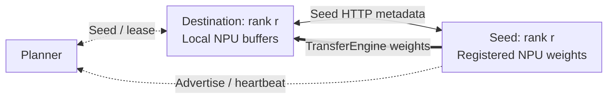
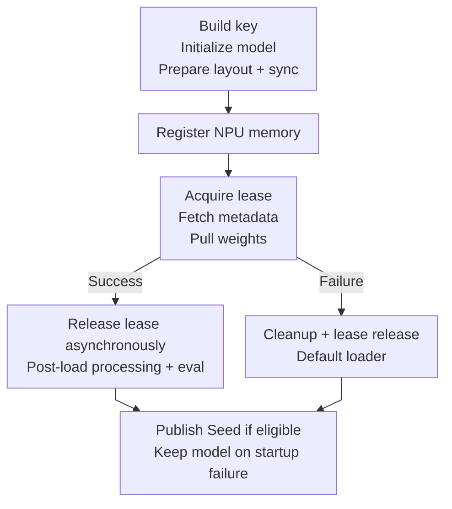

# Tensor R-Fork (RFork) Guide

This guide explains how to use **Tensor R-Fork** as a model-loader plugin in **vLLM Ascend**.

---

## TL;DR

**Tensor R-Fork** stands for **Tensor Remote Fork** and is abbreviated as **RFork**. It is a warm-start weight loading path for vLLM Ascend. Instead of always reading model weights from storage, a new instance can request a compatible **seed** instance from an external planner, then pull weights directly from that seed through `YuanRong TransferEngine`.

The "fork" is a remote tensor-level operation, not an operating-system process fork. RFork treats the NPU memory of an existing vLLM instance as a reusable weight source; the destination creates an independent model instance and reads the seed's registered tensors into its pre-allocated NPU parameter buffers.

## Background

For large models, repeatedly loading the same checkpoint can make storage and host-side staging the main startup bottlenecks. RFork changes the warm-start data path for later replicas:

| Load weights from | Data flow | Typical bottleneck |
|-------------------|-----------|--------------------|
| Remote storage | Remote storage → remote network → local network interface → local host DRAM → local NPU memory | Storage or network bandwidth |
| Local disk | Local disk → host DRAM → NPU memory | Disk bandwidth |
| Local host DRAM | Host DRAM → NPU memory | Host-to-device interconnect |
| RFork seed instance | Seed NPU memory → YuanRong TransferEngine → destination NPU memory | Inter-node transport bandwidth |

This design provides the following benefits for scale-out deployments:

- **Faster warm starts** by reusing tensors that are already resident on another NPU instance.
- **Less repeated storage traffic** because later replicas do not need to read the complete checkpoint again when a compatible seed is available.
- **Less host-side staging** because TransferEngine reads registered tensor ranges into the destination's final NPU buffers.
- **Lower source-side disruption** because the seed exposes registered memory instead of reloading or broadcasting the model through vLLM workers. Actual inference impact still depends on the inter-node transport, available bandwidth, and concurrent transfer load.

The first instance still needs to load the model normally. RFork accelerates subsequent compatible instances; it is not a replacement for the initial checkpoint load.

At cluster scale, this turns running vLLM Ascend replicas into a distributed pool of NPU-resident weight sources. An instance provides inference compute while also making its already-materialized tensors available to later replicas.

### Default Loader vs. RFork

| Characteristic | Default loader | RFork |
|----------------|----------------|-------|
| Weight source | Model storage | Running seed instance |
| Destination path | Storage and host staging before reaching NPU memory | TransferEngine reads into pre-allocated NPU buffers |
| Additional dependency | None beyond the normal model-loading stack | YuanRong TransferEngine and an RFork planner |
| Setup overhead | Storage access and checkpoint deserialization | NPU memory registration and seed discovery |
| Repeated scale-out | Every instance reads the checkpoint | Compatible instances reuse an existing seed |
| Failure behavior | Loading fails if the checkpoint path is unavailable | RFork falls back after successful cleanup; unresolved memory or seed-service cleanup aborts loading |

RFork is most useful when the same model and parallel configuration are started repeatedly. For a single cold start, memory registration and planner coordination add work without an existing seed to reuse.

## Architecture

RFork consists of four cooperating components:

- **Planner**: Tracks seed identity, deployment topology, health, and transfer leases, then selects a compatible seed for each destination.
- **Seed instance**: An initialized vLLM Ascend instance that registers its live NPU weight buffers and publishes TransferEngine metadata.
- **Destination instance**: A new vLLM Ascend instance that creates the matching tensor layout and pulls weights into its local NPU buffers.
- **YuanRong TransferEngine**: Manages registered memory and performs batched reads between the seed and destination.



Dashed arrows show **Planner coordination**, thin arrows show **Seed HTTP metadata exchange**, and the thick arrow shows **TransferEngine weight data**. The destination requests the seed's transfer session, tensor addresses, and shapes over HTTP, then initiates batch reads from Seed NPU memory into its local NPU buffers. The Planner and Seed HTTP service do not carry tensor contents.

The diagram shows one matching rank pair. Each destination worker independently acquires a seed for its TP/PP/EP shard identity and transfers that shard into its own NPU buffers. Different destination ranks may select corresponding seed workers from different instances. After loading and releasing its source lease, a destination can advertise itself as another seed.

### End-to-End Workflow

The RFork loading flow is:

1. vLLM starts with `--load-format rfork`.
2. RFork builds a **seed key** from the model identity and deployment topology.
3. RFork initializes the main model (or prepares the draft model) and identifies fully shared draft weights; a fully shared draft reuses the target directly. It synchronizes any required processed tensor layout before registering local weight memory.
4. RFork registers local weight memory, then makes the single formal seed-lease request. The lease covers remote metadata exchange and batch weight transfer into local parameter buffers. A request that finds no seed or loses a race unregisters the prepared memory, restores the loading state, and falls back to the default loader.
5. After a successful transfer, RFork schedules asynchronous source-lease release, completes any remaining post-load processing, and switches the model to evaluation mode. An unresolved transfer lease is retained for bounded background release and delays seed publication without blocking inference. It then starts a local seed service and advertises it when eligible. A seed-service startup failure retains the loaded model and cleans up Seed resources as far as safely possible.



RFork intentionally performs model initialization, layout preparation, synchronization, and local memory registration before requesting a seed lease. This accepts the setup cost of a no-seed first instance and avoids speculative get/put requests and a second lease race. The single formal lease request follows registration and covers metadata exchange and transfer. A missing seed or a race with another receiver uses the fallback cleanup path, which unregisters the prepared memory and restores the loading state before the default loader runs. Session setup, initialization, layout, registration, or post-load errors use the same cleanup path. If the default loader itself fails, model loading fails.

Source-lease release runs asynchronously with bounded retries. A pending release delays Seed publication without discarding the loaded model; publication can resume after release is acknowledged. Exhausted release retries or incomplete cleanup suppress publication. A Seed service startup or advertisement failure also **keeps the loaded model**, with no checkpoint reload. When dynamic EPLB or a configured static expert map disables RFork, the loader bypasses this flow and uses the default loader directly.

Fallback restores the Ascend MoE layer registry and layer counter, as well as the compilation registries and rotary cache, to their pre-attempt state. This releases discarded expert weights before checkpoint loading, including after partial model construction, while preserving an already loaded target model when a draft attempt fails.

After a processed-layout transfer, RFork refreshes FlatQuant's existing host clipping scalar from the received tensor without repeating layout conversion. Tensor views with storage gaps or overlapping elements are rejected before registration or transfer, causing local fallback and suppressing Seed publication for those layouts; dense transposes remain supported. Seed advertisements are tracked before the HTTP request so cleanup can revoke a potentially accepted advertisement even when its response is lost.

TransferEngine metadata is exchanged through the seed HTTP service, while tensor contents are transferred through TransferEngine. Each worker owns its own TransferEngine session and listening port, so corresponding parallel ranks transfer their local weight shards independently.

### Seed-Side Initialization

After a vLLM Ascend instance finishes loading its model, each RFork worker prepares the tensors that another instance may read:

1. RFork prepares the transferable Ascend tensor layout and enumerates the live model tensors.
2. Logical tensor ranges are associated with their backing NPU allocations. Overlapping logical ranges that share one allocation are registered without registering the same backing memory repeatedly.
3. Registration requests are split into bounded batches before being submitted to YuanRong TransferEngine.
4. The worker publishes its TransferEngine session, tensor addresses, element sizes, and shapes through the local seed service.
5. A heartbeat advertises the seed key, address, port, and rank to the planner.

The seed remains a normal serving instance. RFork does not ask it to reread the checkpoint or run a model-weight broadcast. Transfers can still consume inter-node and NPU-memory bandwidth, so production deployments should control concurrent readers and observe inference latency.

The session checks that its seed HTTP server thread is alive before each heartbeat and after each advertisement request. If the thread exits, RFork stops heartbeats and attempts to remove the advertisement; the loaded model can continue inference. Detection occurs on the next heartbeat, whose default interval is 30 seconds. Registered memory remains retained until normal cleanup because advertisement removal does not prove that existing native reads have finished. If removal fails, shutdown can retry and planner heartbeat expiry can reclaim the advertisement. This check detects thread exit, not a live but unresponsive HTTP server.

### Destination-Side Loading

The destination performs the following steps for each worker rank:

1. Build the seed key, initialize the main model, and identify fully shared draft weights. A fully shared draft reuses the target directly; other drafts continue through layout preparation.
2. Prepare the main model or draft layout, then synchronize any required processed tensor layout.
3. Register the destination tensor ranges with its local TransferEngine session. Registration does not consume the source lease.
4. After registration, make the single formal seed-lease request. If no seed is available or a race makes this request miss, unregister the prepared memory, restore the loading state, and fall back to the default loader.
5. Fetch the matching seed worker's session and tensor manifest over HTTP, verify tensor names, element counts, element sizes, and shapes, then transfer the data.
6. Group tensors into bounded chunks and use batched synchronous reads to copy them into the destination buffers.
7. Schedule bounded asynchronous lease release after the transfer, whether it succeeds or falls back. An unresolved lease remains tracked for release and can delay seed publication without blocking inference.

Once loading completes, the destination can publish itself as another seed. A deployment can therefore grow from one storage-loaded instance into a pool of reusable NPU-resident weight sources.

### Registration and Shutdown Lifecycle

Each worker uses an `RForkSession` to own the planner lease, registered tensors, seed HTTP service, and heartbeat. The session coordinates fallback cleanup and finalizes TransferEngine only after the seed service stops and the outgoing lease is released. Configuration, manifest validation, and HTTP clients are separate RFork modules; startup arguments and environment variable names remain unchanged. Seed startup and cleanup are serialized separately from session state updates. Cleanup stops and joins the heartbeat before removing its advertisement; heartbeat joining, removal HTTP, and server shutdown run outside the session state lock so lease-release acknowledgements can still be applied. Registered memory remains retained until seed cleanup succeeds. Seed health polling and initial advertisement also run outside the session state lock; a transitional state prevents new registration or reads until startup completes. Draft exclusion uses a backend-locked copy of target registration blocks, while target/draft model construction remains serialized.

Registered NPU memory must remain valid while remote readers may still hold leases. RFork therefore keeps Python tensor owners and TransferEngine registration state alive until unregistration or finalization succeeds.

If transfer fails, fallback makes up to two cleanup attempts. If the seed service
or registered memory still cannot be cleaned up, loading fails explicitly while
memory owners remain retained. RFork does not allocate a second model on top of
the pinned weights. A pending source lease alone does not block fallback.

Only a complete model may become a seed. After post-load processing and eval,
RFork re-registers on the loading thread only when checkpoint-layout processing
may have replaced storage; processed-layout transfers reuse the final buffers
directly before publishing or deferring publication. A failed transfer or
incomplete cleanup cannot be treated as a successful seed startup. Workers with
no independent transferable weights do not advertise an empty manifest.

A fully shared draft is identified before any draft post-load processing when
all of its tensor ranges are already shared with the loaded target. Because the
target already has processed buffers, RFork skips all draft post-load
processing and reuses those weights locally, without acquiring a seed lease or
publishing an empty seed. Partial overlap is not treated as complete sharing.

During worker shutdown, RFork first stops advertising the seed, terminates the heartbeat, and closes the local seed service. It then finalizes TransferEngine. If remote reads are still active, finalization retries `ErrorCode.kNotReady` with a bounded delay. If the seed service cannot stop or finalization does not complete within the retry limit, RFork retains the registration state rather than releasing memory that may still be referenced.

During shutdown, RFork cancels new source-lease release retries and does not
wait for an already-running release HTTP request. If that release is still
unacknowledged, RFork retains the associated resources. A lease with no
in-flight release is not retried automatically after shutdown; its cleanup
depends on the planner's agreed expiry or reclamation behavior. Requests
connect/read timeouts limit inactivity for each request, not a bounded total
request duration.

TransferEngine is initialized on the loading thread when memory registration
is first requested. Creating a session, checking fully shared draft weights,
and cleaning up or shutting down a session that never registered memory do not
initialize the engine. Missing TransferEngine dependencies are reported at the
first registration attempt, which follows the normal fallback or seed-start
failure path.

## Application Scenarios

- **Scale-out after a first successful load**: The first instance may still load from storage, but later instances with the same deployment identity can reuse it as a seed and shorten startup time.
- **Elastic serving clusters**: Because RFork asks a planner for available seeds, it fits clusters where instances are created and reclaimed dynamically.
- **Topology-sensitive deployments**: RFork encodes optional `pp_rank`, `tp_rank`, and optional `ep_rank` into the seed key, so only shard-compatible instances are matched together. The `kv_role` and the physical node are deliberately excluded, so prefill and decode instances on different nodes can share seeds.

---

## Usage

To enable RFork, pass `--load-format rfork` and provide RFork settings through `--model-loader-extra-config` as a JSON string.

### RFork Prerequisites

- Install `YuanRong TransferEngine` on every RFork instance.
- Run a planner service that implements the RFork seed protocol. A simple mock planner script is provided at [`rfork_planner.py`](https://github.com/vllm-project/vllm-ascend/blob/main/examples/rfork/rfork_planner.py).

### Configuration Fields

| Field Name | Type | Description | Allowed Values / Notes |
|------------|------|-------------|------------------------|
| **model_url** | String | Logical model identifier used to build the RFork seed key. | Required for RFork transfer. Instances that should share seeds must use the same value. |
| **model_deploy_strategy_name** | String | Deployment strategy identifier used together with `model_url` to build the seed key. | Required for RFork transfer. Instances that should share seeds must use the same value. |
| **rfork_scheduler_url** | String | Base URL of the planner service used for seed allocation, release, and heartbeat. | Required for planner-based matching. Example: `http://127.0.0.1:1223`. |
| **rfork_seed_timeout_sec** | Number | Timeout for waiting until the local seed HTTP service becomes healthy after startup. | Optional. Default: `5.0`. Must be finite and greater than `0`. Invalid values fall back to a valid environment value, then the default. |
| **rfork_request_timeout_sec** | Number | Connection/read timeout for each planner and seed HTTP request, not an end-to-end deadline. | Optional. Default: `10.0`. Must be finite and greater than `0`; invalid values fall back to a valid environment value, then the default. |
| **rfork_heartbeat_interval_sec** | Number | Delay before the next seed heartbeat after the previous heartbeat request completes. | Optional. Default: `30.0`. Must be a finite, positive JSON number. JSON-only `model-loader-extra-config` field; invalid explicit values raise `ValueError`; no environment fallback. |
| **rfork_lease_release_max_attempts** | Integer | Maximum number of attempts for lease release, including the initial request. | Optional. Default: `3`. Must be a positive JSON integer. JSON-only `model-loader-extra-config` field; invalid explicit values raise `ValueError`; no environment fallback. Rejected responses stop immediately. |
| **rfork_lease_release_retry_interval_sec** | Number | Wait between transient lease-release failures. | Optional. Default: `30.0`. Must be a finite, positive JSON number. JSON-only `model-loader-extra-config` field; invalid explicit values raise `ValueError`; no environment fallback. |
| **rfork_seed_bind_host** | String | Local address/interface for the seed HTTP server. | Optional. Default: `0.0.0.0`. |
| **rfork_seed_advertise_host** | String | Address reported to the planner for later receivers. | Optional. Default: auto-detect the local address. |

RFork manages its environment fallbacks in its own `RForkConfig` configuration module:

The request timeout also accepts `request_timeout_sec`. Bind host accepts
`seed_bind_host` and `bind_host`; advertise host accepts `seed_advertise_host`
and `advertise_host`. When several aliases are provided, the first present key
wins in the order shown here, with the `rfork_` field taking precedence.

| Environment variable | Default | Notes |
|----------------------|---------|-------|
| `MODEL_URL` | unset | |
| `MODEL_DEPLOY_STRATEGY_NAME` | unset | |
| `RFORK_SCHEDULER_URL` | unset | |
| `RFORK_SEED_TIMEOUT_SEC` | `5.0` | Finite and positive only. |
| `RFORK_REQUEST_TIMEOUT_SEC` | `10.0` | Finite and positive only. |
| `RFORK_SEED_BIND_HOST` | `0.0.0.0` | |
| `RFORK_SEED_ADVERTISE_HOST` | auto-detect | |

`model_loader_extra_config` takes precedence over environment values for fields
that support environment fallbacks. Numeric values reject booleans, NaN,
infinity, and non-positive values. The four operational fields above are
JSON-only; invalid explicit values raise `ValueError` rather than using an
environment fallback.

Heartbeat scheduling waits `rfork_heartbeat_interval_sec` after each heartbeat
request completes (default: `30.0`); it is not a fixed-rate interval. Seed
heartbeats report health and do not renew leases. The lease-release fields
affect lease release only. Client-side seed deregistration
(`remove_seed`) keeps its internal retry policy of three attempts with
`0.1`-second linear backoff.

### How RFork Matches Seeds

RFork does not match instances by `model_url` alone. The seed identity is composed from:

- `model_url`
- `model_deploy_strategy_name`
- `pp_rank` when pipeline parallel size is greater than 1
- `tp_rank`
- `ep_rank` when expert parallelism is enabled for an MoE model
- `draft` role when the worker runs as a draft model

The parallel ranks keep seed and receiver on the same model shard, while the
disaggregation role (`kv_role`) and the physical node are deliberately excluded
so prefill and decode instances on different nodes can share seeds.

The identity is anchored by a SHA256 compatibility fingerprint covering model
revision, dtype, quantization method, a digest of the full quantization config,
model architecture, tensor/pipeline/expert parallel world sizes, Ascend NZ
layout mode, and hardware layout policy. This prevents an old or differently
configured seed from being selected merely because its textual key happens to
match.

Revision matching prefers the resolved checkpoint commit hash over a requested branch or tag such as `main`. Different commits therefore produce different fingerprints even when the requested revision is unchanged. If no commit hash is available, RFork uses the configured revision identifier; deployments using local checkpoints must supply an immutable model identity or deployment-strategy name when weights change. RFork does not hash local checkpoint contents.

Two instances must agree on model identity and parallel layout before the planner will treat them as interchangeable seeds. The seed key is an opaque SHA256 digest, so seed and receiver instances must run the same RFork protocol to derive the same key.

### Planner Responsibilities

Lease release runs asynchronously after transfer. Planner release requests never hold the session lock. The client makes at most `rfork_lease_release_max_attempts` release attempts per lease (default: `3`, including the initial request), waiting `rfork_lease_release_retry_interval_sec` seconds (default: `30.0`) between transient failures (network errors, HTTP 408/429, or 5xx). These settings affect lease release only. Other rejected responses stop immediately even when attempts remain; HTTP 200 and 404 retain their existing acknowledgement semantics. Failed releases do not reload valid weights or prevent model loading from continuing, but the worker is not advertised as a new seed until release is acknowledged. After retry exhaustion, the unresolved lease remains recorded and requires planner-side investigation/recovery. Shutdown does not wait for release I/O and retains TransferEngine resources if release is unresolved.

Release logs include a hashed lease identifier, attempt count, elapsed acquisition-to-release time, HTTP status and a bounded response excerpt with control characters removed and the lease ID redacted. These allow diagnosis without printing the raw USER_ID credential. Per-request timeouts are connect/read inactivity limits, not a strict total wall-clock deadline. Lease acquisition and release outcomes are logged at INFO; detailed successful HTTP release responses remain at DEBUG. HTTP 404 release acknowledgements remain at INFO because they do not verify timely release. Release failures remain visible at WARNING/ERROR.

The example planner reclaims abandoned leases after 60 seconds by default, independently of seed heartbeat expiry. Configure a positive integer duration with `--lease-ttl-sec` or `RFORK_MOCK_LEASE_TTL_SEC`; an explicit CLI value takes precedence over a valid environment value. The loader acquires the single formal lease after local registration; it then covers metadata fetch and transfer. The formal request can still race with another receiver and miss, which follows the cleanup and fallback path. A transfer lease is retained for bounded background release; its first release request counts toward the configured maximum of three attempts, and unresolved release delays seed publication without blocking inference. Initialization and layout timings are logged separately at INFO. Seed heartbeats do not renew leases. Expired leases return 404 on release, which the current client accepts as already released; successful startup alone does not prove that the lease remained valid throughout transfer.

The first instance may complete model initialization, layout preparation, and memory registration before the planner reports that no seed is available. In that case, the loader unregisters the prepared memory, restores the compilation registries and rotary cache, and loads from the checkpoint. A fully shared draft reuses the target model directly; other drafts follow the same layout and registration path. Model construction and rollback in a worker are assumed to be serialized. Lease renewal is not enabled: seed heartbeats report health but do not renew leases, and renewal requires explicit support from both planner and client.

For example, start the planner with a 60-second lease TTL:

```text
python examples/rfork/rfork_planner.py --host 0.0.0.0 --port 1223 --lease-ttl-sec 60
```

Increasing the lease TTL does not change the seed heartbeat TTL (`--heartbeat-ttl-sec`, default 60 seconds). The planner process reads these settings at startup; changing a client-side environment variable does not reconfigure a running planner.

After an instance becomes ready, each worker periodically reports its seed metadata to the planner. A new instance asks the planner for a seed with the same seed key; the planner selects one with available capacity and returns a lease. A missing or unhealthy seed is not fatal because the destination can use the default loader and later join the seed pool itself.

The bundled planner demonstrates this workflow, but it is a functional example rather than a production scheduler. A production planner should provide:

- compatibility matching based on model identity and parallel deployment topology;
- heartbeat-based health tracking and stale-seed removal;
- capacity and lease accounting so one seed is not overloaded by concurrent destinations;
- reliable lease release when a transfer completes or fails;
- observability for seed selection, transfer failures, and fallback frequency.

### Quantized Models

For quantized models, RFork transfers tensors after Ascend weight post-processing instead of raw checkpoint parameters. The receiver first builds the same post-load tensor layout as the seed, then RFork copies the live NPU tensors used by inference.

This path handles Ascend quantization changes such as weight transposition, NZ format conversion, packed weights, derived scale tensors, and MLA/SFA runtime tensors such as `W_UV` and `W_UK_T`. Empty tensors that were released during post-processing are not included in the transfer manifest.

### Tensor Layout Design

RFork is a transfer path between compatible model instances, not a general-purpose tensor serializer. Its design preserves the model's established loading stages: prepare the receiver's inference layout before copying processed weights, or transfer the tensors required by the checkpoint path and then run the remaining post-load hooks. The transfer contract therefore depends on both the tensor representation and the loading stage.

Raw-byte transfer of the prepared tensor layout is intentional. RFork supports dense transposes and permutations without forcing every tensor to become contiguous. It can also adjust a receiver tensor to the seed shape with an in-place storage-preserving view when the element count matches. This preserves the historical quantized-model transfer design, which builds the inference layout before copying weights instead of repeating packing or transposition after transfer. Both instances must interpret the transferred bytes with the same effective layout; shape equality alone does not establish stride compatibility, and the manifest currently does not compare remote strides.

NZ transfer is also intentional: RFork copies prepared NPU tensors using `numel() * element_size()` bytes per tensor, rather than serializing checkpoint tensors or blindly copying entire allocator blocks. This relies on the target model's layout and alignment making that byte range sufficient for its physical representation. It is not a guarantee for arbitrary NZ tensors with padding. Validate physical layout, transfer coverage and inference accuracy on the intended NPU/model combination; CPU layout tests cannot establish NZ padding correctness.

Checkpoint-layout transfer requires every non-shared local tensor to be present in the seed manifest, but allows the seed to contain additional tensors generated by post-load processing. Their metadata is validated and their bytes are not read. The receiver rebuilds required derived tensors during its normal post-load step; for example, unquantized MLA rebuilds `W_UV` and `W_UK_T` from the transferred `kv_b_proj.weight`. Processed-layout transfers still require matching final tensor inventories, apart from target-shared draft tensors. If the seed has disposed a checkpoint tensor still required by the receiver, RFork continues to fall back rather than performing an incomplete transfer.

Allowing a seed superset in the checkpoint path is an intentional stage-dependent contract. The seed has completed loading, while the receiver has not yet created all derived tensors; requiring identical inventories at this point would reject a valid source. The local inventory determines the bytes that must be transferred. Every required local entry must match the seed's dtype, element count and element size, while the existing shape/view rules still apply. Seed-only entries never supply substitute data for a missing local weight. In the processed-layout path, both sides have already prepared their final tensors, so the stricter inventory check remains appropriate.

For example, an unquantized MLA seed may expose `kv_b_proj.weight`, `impl.W_UV`, `impl.W_UK_T` and `impl.mlapo_W_UK_T`. A checkpoint receiver initially needs only `kv_b_proj.weight`; after copying it, the MLA post-load hook constructs the other tensors. Transferring those derived tensors as well is unnecessary for this path. In a processed-layout transfer, the receiver prepares the derived tensors first and receives them directly, avoiding a second layout conversion after transfer.

### Historical Rationale and Validation

The quantized transfer change in [PR #10128](https://github.com/vllm-project/vllm-ascend/pull/10128) (June 22, 2026) explicitly introduced prepared-layout copying, seed-shape views, and runtime tensor collection for transposed/NZ/packed weights and derived scales. Its commit record reports manual Ascend A2 validation, including GLM-5-W4A8 and DeepSeek-V4-Flash-W8A8-MTP, with successful transfer logs and a normal chat completion. [PR #12995](https://github.com/vllm-project/vllm-ascend/pull/12995) (August 6, 2026) then separated checkpoint and processed inventories, synchronized layout preparation, and avoided repeated unquantized MoE post-load conversion while preserving the remaining hooks.

These results support the design for the tested model, configuration, code and hardware combinations. They do not establish that every equal-shape tensor has compatible strides, or that every NZ padding layout fits the logical byte count. The later strict seed/local inventory equality check conflicted with the checkpoint path's different loading stages; accepting a validated seed superset restores that behavior without changing the raw-byte or NZ design. The current CPU regression also executes the real MLA post-load hook with NPU operators replaced, verifies that only the base weight is read, and compares the rebuilt derived tensors with the seed; it complements rather than replaces NPU validation.

### Validation

When validating RFork for a quantized model:

- Apply the same vLLM Ascend code to both the seed instance and the receiver instance.
- Restart the planner and all vLLM instances after changing RFork code, because existing seeds keep their old transfer metadata.
- Use a new `model_deploy_strategy_name` after changing model arguments or RFork code when operating with an older planner; compatibility fingerprints also reject incompatible old seeds before native transfer.
- Successful model loading logs `RFork main model loading completed` (or `draft`) with `source=transfer`, `local` (seed miss), `fallback` (RFork failure), or `shared_target`. Transfer failures also log `RFork transfer failed`.

Loading summaries and startup stage diagnostics are INFO on every rank. Their elapsed time covers that worker's loader call, including any failed RFork attempt, local fallback, and synchronous seed-service startup; it is not the maximum across ranks or time until the engine is ready, and does not wait for deferred seed promotion to finish. The default INFO level includes per-rank initialization, layout, registration, metadata/read timings, lease outcomes, and seed publication or deferral. Successful periodic heartbeats and individual transfer-chunk progress remain DEBUG; failures remain WARNING/ERROR on every rank.

Every transferable tensor emits `RFork tensor layout` at INFO during `registration` on both endpoints and at `receiver_before_read` after any seed-shape view on the receiver. Match the receiver's `peer_session` and tensor `name` to the seed's `session` and `name`; use the seed's latest registration before `RFork seed service started`, which also reports its session. A checkpoint seed refreshes registration after post-load processing. A processed-layout receiver that becomes a seed reuses the layout logged before its read. Shared draft tensors excluded from transfer have no separate layout record. Each record includes layout mode, device, dtype, shape, stride, data pointer, storage pointer/offset, `logical_bytes` (the actual read length), `storage_bytes` (the full untyped storage byte capacity, possibly shared by views), `npu_format`, and `npu_storage_numel` (physical storage-descriptor element count, including format padding). The descriptor count is not multiplied by the current dtype size because packed dtype views can retain a different physical representation. Storage capacity is not the allocator block size or proof that all bytes need copying. Unavailable metadata is marked explicitly with an error type; inspection does not copy weights, convert formats, or synchronize the NPU. These are local observations on each endpoint, not new wire metadata or an automatic layout compatibility check. Logging every tensor increases startup log volume.

## Supported Models

Mainstream DeepSeek/Qwen/GLM series are supported.

## Performance Considerations

RFork indexes tensor intervals for allocator-block lookup and uses binary search to verify backing-memory coverage before registration. New seed services return weight and shape metadata together in one HTTP response; receivers retain the two-request path for older seed services that omit inline shape metadata.

RFork performance depends on model size, parallelism, NPU memory layout, TransferEngine registration time, inter-node bandwidth, and the number of concurrent destinations.

For an NPU deployment, compare RFork with the default loader using at least these metrics:

- time from process start until the service becomes ready;
- registration/metadata/read timings in `RFork transfer stages`, and transferred bytes/throughput in `RFork weight transfer completed` (INFO logs);
- storage and host-memory traffic during startup;
- seed-instance inference latency while transfers are active;
- seed hit rate, transfer failure rate, and fallback rate.

Memory registration adds setup cost to the seed. Its benefit is realized when later replicas reuse that registration, so tests should include repeated scale-out rather than only a single cold start.

---

## Example Commands & Placeholders

> Replace parts in `<...>` before running.

### 1. Install YuanRong TransferEngine

```shell
pip install openyuanrong-datasystem
```

### 2. Start the Planner

A simple planner implementation is provided at [`rfork_planner.py`](https://github.com/vllm-project/vllm-ascend/blob/main/examples/rfork/rfork_planner.py).

```shell
python rfork_planner.py \
  --host 0.0.0.0 \
  --port <planner_port>
```

### 3. Start vLLM Instances

Use the same RFork startup command for both the first instance and later instances in the same deployment.

For the first instance, the planner usually has no compatible seed yet, so RFork falls back to the default loader. After loading finishes, that instance starts its local seed service and reports itself to the planner.

For later instances, if the planner can allocate a compatible seed, RFork will try to transfer weights from the existing seed instance before falling back to the default loader.

```shell
export RFORK_CONFIG='{
  "model_url": "<model_url>",
  "model_deploy_strategy_name": "<deploy_strategy>",
  "rfork_scheduler_url": "http://<planner_ip>:<planner_port>",
  "rfork_request_timeout_sec": 10.0,
  "rfork_heartbeat_interval_sec": 30.0,
  "rfork_lease_release_max_attempts": 3,
  "rfork_lease_release_retry_interval_sec": 30.0,
  "rfork_seed_bind_host": "0.0.0.0",
  "rfork_seed_advertise_host": "<seed_ip>"
}'

vllm serve <model_path> \
  --tensor-parallel-size 1 \
  --served-model-name <served_model_name> \
  --port <port> \
  --load-format rfork \
  --model-loader-extra-config "${RFORK_CONFIG}"
```

### Placeholder Descriptions

- `<model_path>`: Model path or model identifier passed to `vllm serve`.
- `<served_model_name>`: Service name exposed by vLLM.
- `<planner_ip>`: IP address or hostname of the RFork planner.
- `<planner_port>`: Listening port of the RFork planner.
- `<model_url>`: Stable model identity string used to build the RFork seed key.
- `<deploy_strategy>`: Stable deployment-strategy name used to build the RFork seed key.
- `<port>`: Serving port of the vLLM instance being started.

---

## Note & Caveats

- RFork requires `MemoryRegistration`, `ErrorCode.kNotReady`, `batch_register_memory_ex()`, and `finalize()` from `YuanRong TransferEngine`. Packages without these APIs cannot initialize the transfer backend; RFork falls back to the default loader and does not start a seed service.
- If RFork is used, **each worker process** must bind a listening port. The seed bind host is configurable and the port is assigned randomly.
- RFork currently requires all materialized model parameters and registered buffers to reside on NPU. Mixed CPU/NPU or CPU-offloaded model state is rejected and falls back to the default loader rather than performing a partial transfer.
- Keep the seed bind/advertise addresses reachable from the receiver workers. Transport encryption and access control remain the deployment's responsibility, so use HTTPS and network isolation for untrusted networks.
- RFork serializes metadata fetches and RDMA reads with shutdown and fallback cleanup to keep registered buffers alive until reads finish. Shutdown may wait for an active transfer before stopping services and finalizing the backend. HTTP request timeouts do not impose an end-to-end RDMA or shutdown deadline; measure shutdown latency during large-model transfers when setting deployment termination grace periods.
- The seed HTTP server defaults to `0.0.0.0` and has no client authentication. `seed_key` is a model compatibility identifier, not a secret credential, and query parameters may appear in access or proxy logs. Bind `rfork_seed_bind_host` to a trusted local interface, restrict network access to authorized workers, and protect metadata logs. Changing the key to an HTTP header alone would not provide authentication.
- On hosts with multiple network interfaces, configure `rfork_seed_bind_host` and `rfork_seed_advertise_host` explicitly. The advertised seed address serves HTTP metadata; the TransferEngine endpoint in `session_id` is selected separately through `get_ip()`. Changing the HTTP advertise address does not change the RDMA endpoint. The addresses need not match, but receivers must be able to reach both over the intended networks.
- RFork weight transfer does not support dynamic EPLB because expert weights and placement can change after the seed service starts. If `parallel_config.enable_eplb`, `eplb_config.dynamic_eplb`, or `eplb_config.expert_map_record_path` enables EPLB, RFork transfer is bypassed and the model is loaded through the default model loader.
- Configuring a non-null `eplb_config.expert_map_path` also disables RFork, even when dynamic EPLB is off. Static expert placement is not covered by the compatibility fingerprint, so matching ranks and tensor shapes cannot establish compatibility. The main and draft models use the default loader directly, without creating RFork sessions, acquiring seed leases, registering transfer memory, or publishing seeds. No planner changes are required.
- RFork is bypassed when `model_config.enable_sleep_mode` is enabled or `weight_transfer_config` is configured. Target and draft models use the default loader without publishing seeds, so sleep and online weight updates can proceed normally. Configure these options before loading; RFork does not support draining and re-registering weights around runtime mutations.
- A worker that has already created an RFork session rejects `sleep`, `start_weight_update`, `update_weights`, `finish_weight_update`, and `reload_weights` before modifying memory. This includes draft sessions and sessions retaining resources after failed cleanup. To use these operations, restart with `--load-format auto` for both target and draft, or configure sleep mode/online weight transfer before loading.
- The example [`rfork_planner.py`](https://github.com/vllm-project/vllm-ascend/blob/main/examples/rfork/rfork_planner.py) is only a simple mock implementation. If you need stronger scheduling, capacity management, or production-grade availability behavior, implement your own planner based on the RFork seed protocol.
